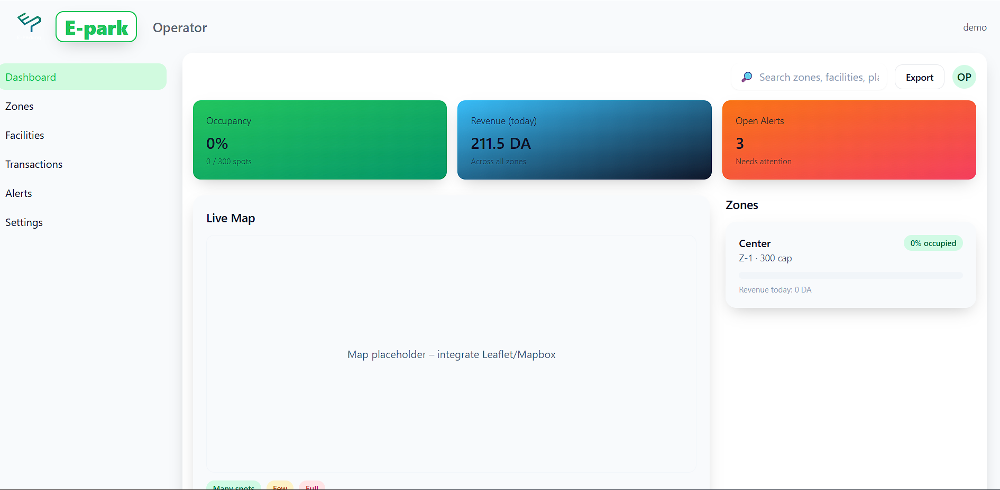
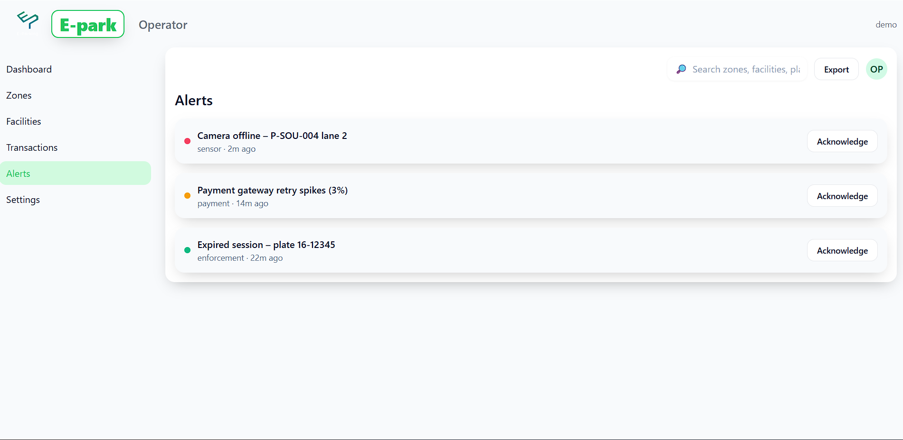

# E‑parking (Team NCS)
    # Team
    -zobir ahmed abdarrouf
    -Bouzekri Mohamed
    -lebbouz mohammed chems eddine 
    -bougaussa mohamed alaa  

**Operator Web** + **Driver App** + **Backend API** (+ optional **Vision**). Short and visual to prove the work.  
Repos:
- **Operator page:** https://github.com/MeD-bouzekri/E-park-admin
- **Driver App:** https://github.com/raouf-zobir/EasyPark-MobileApp

---

## 📸 Screenshots

### Operator Web
| Dashboard | Zones |
| --- | --- |
|  |  |

### Driver App
| Map/Home | Reservation |
| --- | --- |
|  |  |

### Vision (optional)


---

## 🧱 Stack
- **Web:** React + Tailwind (Operator)
- **Mobile:** flutter (Driver)
- **Backend:** Node.js (Express) + MongoDB (Mongoose)
- **Vision:** FastAPI + YOLOv8 + EasyOCR 

---

## ▶️ Run (dev)

### Server (E-park-admin)
```bash
cd server
cp .env.example .env
npm i
npm run seed   # if available
npm run dev    # http://localhost:8080
```

### Operator Web
```bash
cd client
cp .env.example .env     # VITE_API_URL=http://localhost:8080
npm i
npm run dev              # http://localhost:5173
```

### Driver App (Expo)
```bash
cd mobile
cp .env.example .env     # EXPO_PUBLIC_API_URL=http://localhost:8080
npm i
npx expo start
```

---

## 🗺️ Architecture (high‑level)
Web + Mobile → **Backend API** → **MongoDB**  
(Optional) Cameras → **Vision Service** → Occupancy/Plates → Backend

---

## 📄 License
MIT © Team NCS